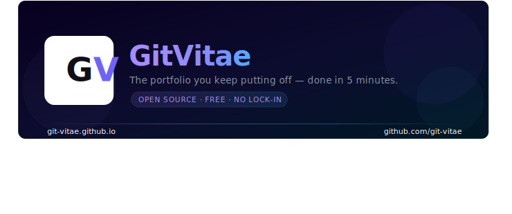

# GitVitae — The portfolio you keep putting off, done in 5 minutes.

Fill in one YAML file. Get a live portfolio, two resume formats, and a PDF export — hosted free on GitHub Pages. Forever.

→ **[Live Demo](https://git-vitae.github.io)** · **[Fork & Get Started](https://github.com/git-vitae/git-vitae.github.io/fork)** · **[Setup Guide](https://git-vitae.github.io/#/setup)**

---

## What you get

- 🌐 A live portfolio site at `yourusername.github.io`
- 📄 Two resume formats — a modern two-column layout and a clean ATS-friendly classic
- ⬇️ One-click PDF export
- 🔒 Your data lives in a repo you own — no subscriptions, no platform lock-in

---

## How it works

1. **[Fork the repo](https://github.com/git-vitae/git-vitae.github.io/fork)**
2. Edit `portfolio.config.yaml` with your details — it's fully commented, no coding needed
3. Go to **Settings → Pages → Deploy from branch → main**
4. Your portfolio is live ✅

---

## One honest tradeoff

Your URL defaults to `yourusername.github.io`. A custom domain fixes it — costs ~$12/year through any registrar, point it at GitHub Pages and you're done.

---

**PRs welcome.** If you improve it, share it back.
